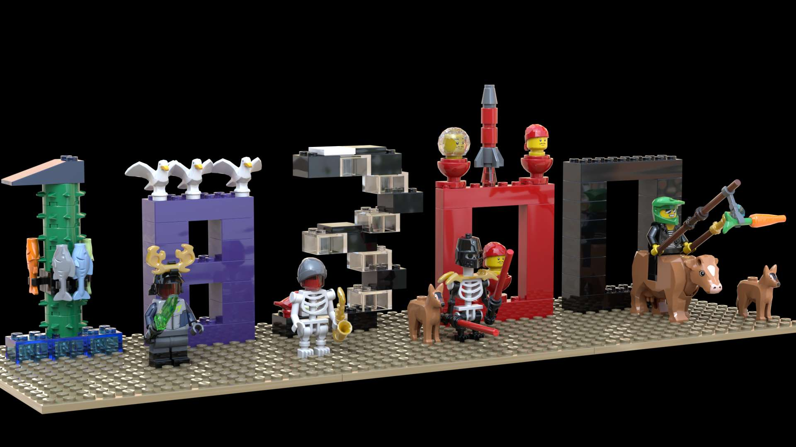

# Team 18300 Robotics 

## First Game Rules, Judging, and other Information
[2023 MasterPiece Robot Game Rules](https://firstinspiresst01.blob.core.windows.net/first-in-show-masterpiece/fll-challenge/fll-challenge-masterpiece-rgr-en.pdf)

[2023 MasterPiece Challenge Updates](https://firstinspiresst01.blob.core.windows.net/first-in-show-masterpiece/fll-challenge/fll-challenge-masterpiece-challenge-updates.pdf)

[2023 MasterPiece Robot Game Scoring Tool](https://flltools.flltutorials.com/scorer)

[2023 MasterPiece Judging Rubric](https://firstinspiresst01.blob.core.windows.net/first-in-show-masterpiece/fll-challenge/fll-challenge-masterpiece-rubrics-color.pdf)

[2023 MasterPiece Mission Model Build Instructions](https://www.firstlegoleague.org/season#resources)

[M15 - Expert Locations](https://github.com/fll-18300/home/blob/main/expert_locations.jpg)

## Task Tracking
[Team 18300 Kanban Board](https://fllteam18300.atlassian.net/)

## 2023 Team Code
[Team 18300's Robot Tape Measure Code](https://github.com/18300_measure/18300_measure)
[Team 18300's 2023 Robot Code](https://github.com/fll-18300/fall_2023)

## Meeting Slides & Notes
[Robot Presentation ToDo List](https://fll-18300.github.io/home/robot_todo_list.htm)

[18300 Engineering Methods and Tools](https://github.com/fll-18300/home/blob/main/meeting_090623.pdf)

## Reference Information
[Bolton Robotics Spring Training Website](https://fssfll.github.io/fssfll/)

[Pybrics Documentation](https://pybricks.com/ev3-micropython/index.html)

[Team 18300's 2022 Robot Code](https://github.com/fll-18300/fall_2022)

## Team 18300's Basebot Build Instructions
<a class="buildin3d-instructions" href="https://platform.buildin3d.com/instructions/987-team-18300-s-fll-basebot" width="710" height="590">Team 18300's FLL Basebot</a>
