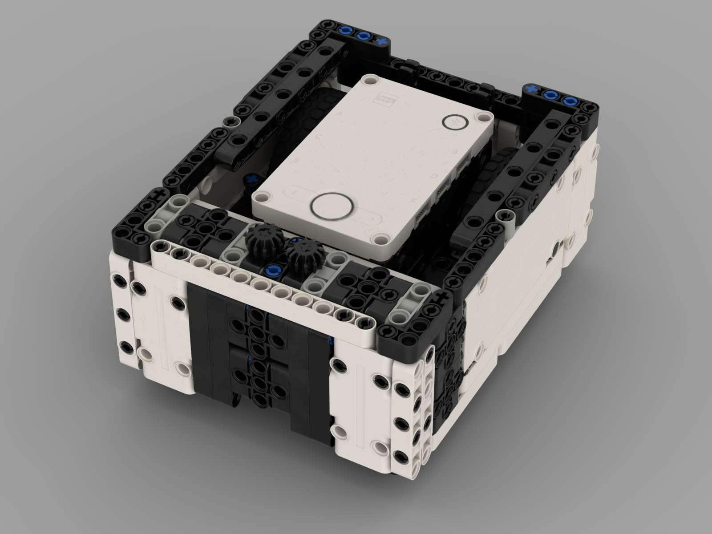

# Team 18300 Robotics - Unearthed 2025

## 2025 Fall Schedule
  Meet on Wednesdays afterschool
  
  Extra weekly meeting - TBD (likely either Friday evenings at the school or Sunday evenings)
  
  Important Dates:
  - WaterFire Outrached Event (optional event) 9/27 5:30 - 9:00 
  - Backyard Bolton Outreach Event  (optional event) 10/18 9:45 - 2:00
  - FSS Scrimmage (Robot Only) 10/24 5:00 - 8:00 PM
  - Titan Test Drive Scrimmage (Robot Only) 11/8 8:00 - 1:00 PM
  - Qualifier: TBD - Guessing Dec 6th or 7th all day
  - Robonautica: December 13th all day 

## First Game Rules, Judging, and other Information
[2025 Unearthed Robot Game Rule](https://firstinspires.blob.core.windows.net/fll/challenge/2025-26/fll-challenge-unearthed-rgr.pdf)

[2025 Unearthed Challenge Updates](https://firstinspires.blob.core.windows.net/fll/challenge/2025-26/fll-challenge-unearthed-challenge-updates.pdf)

[2025 Unearthed Robot Game Scoring Tool](https://eventhub.firstinspires.org/scoresheet)

[2025 Unearthed Judging Rubric](https://firstinspires.blob.core.windows.net/fll/challenge/2025-26/fll-challenge-unearthed-rubrics-color.pdf)

[2025 Unearthed 3D Interactive Mission Model Build Instructions](https://www.fllcasts.com/competitions/first-lego-league/2025-unearthed/building-instructions)

[2025 Unearthed Field Setup Guide](https://firstinspires.blob.core.windows.net/fll/challenge/2025-26/fll-challenge-unearthed-field-setup-reference-guide.pdf)

[2025 Unearthed Map Planning Tool](https://flltools.flltutorials.com/drawplan)

## Task Tracking
[Team 18300 Kanban Board - 2025](https://team18300.atlassian.net/jira/your-work)

## 2025 Team Code
[Team 18300's 2025 Spike Prime Robot Code](https://github.com/fll-18300/fall_2025)

## Meeting Notes
[Week #6: 10/1/25](https://fll-18300.github.io/home/weekly_updates/oct1/oct1.md)

[Week #4: 9/17/25](https://fll-18300.github.io/home/weekly_updates/sept17/sept17.html)

[Week #3: 9/9/25](https://fll-18300.github.io/home/weekly_updates/sept10/sept10.html)

[Week #2: 9/3/25](https://fll-18300.github.io/home/weekly_updates/sept3/sept3.html)

[Week #1: 8/28/25](https://fll-18300.github.io/home/weekly_updates/week828.html)

## Reference Information
[Bolton Robotics Spring Training Website](https://fssfll.github.io/fssfll/spike/index.html)

[Pybrics IDE](https://code.pybricks.com/)

[Team 18300's 2024 EV3 Robot Code](https://github.com/fll-18300/fall_2024)

[Team 18300's 2023 EV3 Robot Code](https://github.com/fll-18300/fall_2023)

[Team 18300's 2022 EV3 Robot Code](https://github.com/fll-18300/fall_2022)

## Team 18300's Basebot Build Instructions
Basebot Selection is TBD

  
Option #1: Spike Boxbot  

  
  
    
  
  <A HREF="https://github.com/fll-18300/basebot_build_instructions/blob/main/18300_bot_v1p0.pdf">Build Instructions</A>

    
  
  <a class="buildin3d-instructions" href="https://platform.buildin3d.com/instructions/6216-team-18300-fll-bot-v1-0" width="710" height="590">Team 18300 FLL Bot V1.0</a>

    
  

Option #2: Bolton Robotics BaseBot

<a class="buildin3d-instructions" href="https://platform.buildin3d.com/instructions/4136-bolton-robotic-s-first-lego-league-basebot" width="710" height="590">Bolton Robotic's First Lego League Basebot</a>
